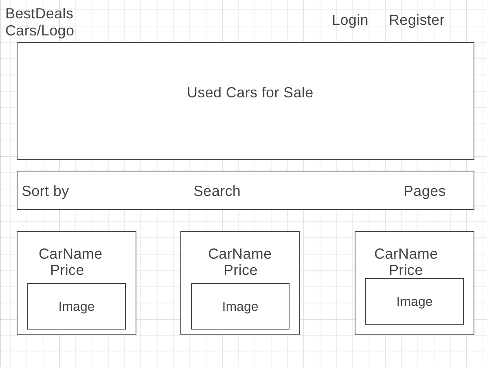
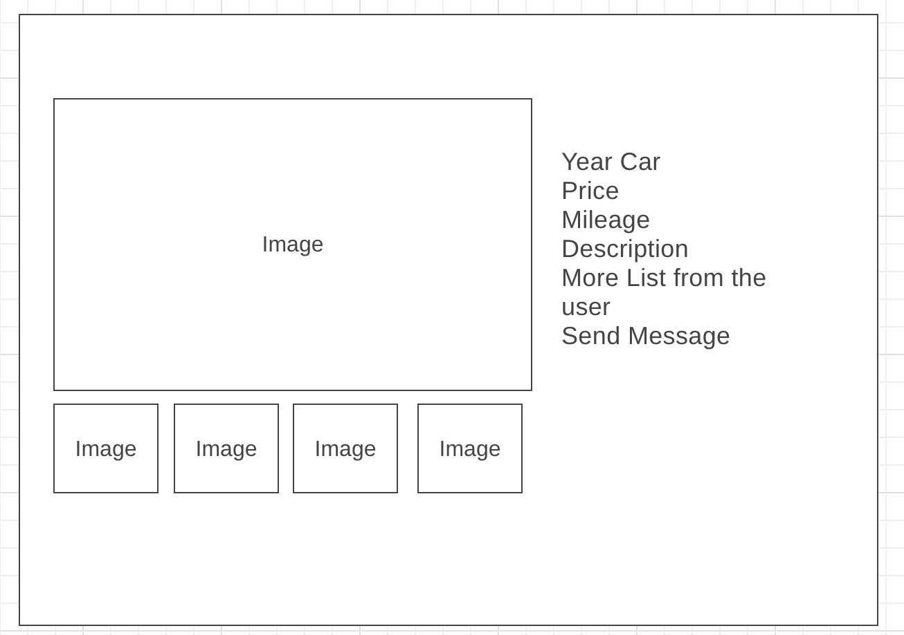
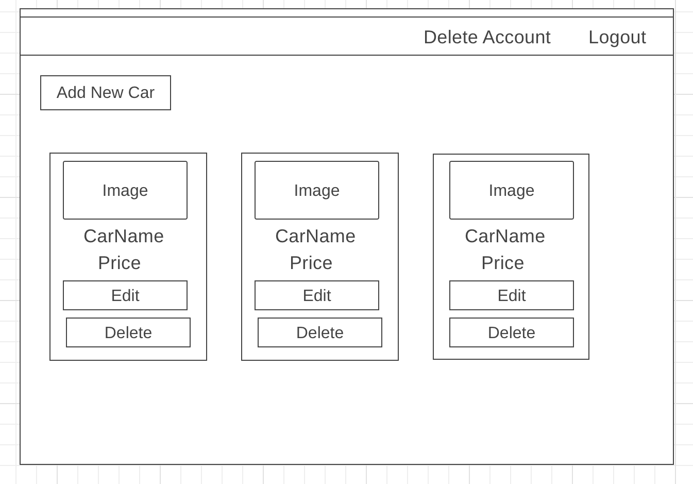

# Usedcars-project1

## Scope

The objective is to build an app where users can buy or sell their cars with other users. Users
will be able to see their cars, other user’s cars or search and sort the whole database for cars.

## User Stories

Non-Authenticated Users can:

* View home page
* View all cars for sale
* Filter/search cars
* Sign Up to BestDeals
* Login in their BestDeals Account

Authenticated User can:

* View home page
* View all cars for sale
* Filter/search cars
* View their profile page
* Create posts for selling car (with image)
* Edit posts for car they sell
* Delete posts for car they sell
* Chat with other user/buyer
* Delete Account

## Wireframes

 **Home Page**

Users will see logo Login/Register Link and car images with name and price.

**Car Details Page**

Users will see details of car with images and will contact the seller after Register.

**Profile Page**

User will see listing of his cars and add/edit/delete cars. Also, he will see chat button
to chat with buyer.

## Data Models

**Users**

* Username
* Password
* Phone

**Cars**

* Name
* Price
* Year
* Mileage
* Description
* Image
* [Userid]

**Message**

* SenderandReciever
* Story

**User Stories**

Non-Authenticated Users can:

* View home page
* View all cars for sale
* Filter/search cars
* Sign Up to BestDeals
* Login in their BestDeals Account

Authenticated User can:

* View home page
* View all cars for sale
* Filter/search cars
* View their profile page
* Create posts for selling car (with image)
* Edit posts for car they sell
* Delete posts for car they sell
* Chat with other user/buyer

**Wireframes**

## Home Page

Users will see logo Login/Register Link and car images with name and price.

## Car Details Page

Users will see details of car with images and will contact the seller after Register.

## Profile Page

User will see listing of his cars and add/edit/delete cars. Also, he will see chat button
to chat with buyer.

**Data Models**

## Users

* Username
* Password
* Phone

## Cars

* Name
* Price
* Year
* Mileage
* Description
* Image
* [Userid]

## Message

* SenderandReciever
* Story
